# Bank of Anthos (AI-Enhanced)

**Bank of Anthos** is a sample HTTP-based web app that simulates a bank's payment processing network, allowing users to create artificial bank accounts and complete transactions.

Originally developed by [Google Cloud](https://github.com/GoogleCloudPlatform/bank-of-anthos) as a reference application to demonstrate enterprise modernization with products like [GKE](https://cloud.google.com/kubernetes-engine), [Anthos Service Mesh](https://cloud.google.com/anthos/service-mesh), and [Cloud SQL](https://cloud.google.com/sql/docs), the original system was a straightforward CRUD banking app — users could sign up, log in, send payments, and view transaction history. It had no fraud detection, no budgeting, no AI, and no conversational interface.

**This fork extends the original Bank of Anthos with a full AI-powered services layer**, adding intelligent features on top of the existing core without modifying any of the original microservices.

---

## What Changed: Original vs. AI-Enhanced

| Capability | Original Bank of Anthos | This Fork (AI-Enhanced) |
|:---|:---|:---|
| **User Interface** | Basic Jinja2-templated HTML pages | Modern React/Vite SPA with Tailwind CSS |
| **Transactions** | Manual form-based send/deposit | Manual + Natural language Query Transactions  |
| **Fraud Detection** | None | Real-time anomaly detection with explainable risk scores |
| **Budgeting** | None | Full CRUD budget management with spend tracking |
| **Financial Insights** | None | AI-powered spending summaries and saving tips (Gemini) |
| **Contact Management** | Basic add-only list | Fuzzy name matching, validation, update, and delete (CRUD) |
| **Conversational AI** | None | Multi-turn chat assistant powered by Google Gemini which can perform all banking tasks supported by system via natural language |
| **Currency Support** | USD only | Automatic multi-currency conversion with live rates |
| **Core Services Modified** | — | **Zero.** All original Java/Python services are untouched. |

### Design Philosophy: Additive Architecture

The key architectural decision was to build **on top of** the existing system rather than refactoring it. As shown in the architecture diagram:

- **The core services are untouched.** The Java services (`ledger-writer`, `balance-reader`, `transaction-history`) and the Python services (`user-service`, `contacts`) run exactly as Google designed them. No code was changed, no APIs were altered.
- **The AI layer acts as an intelligent middleware.** New "Sage" microservices sit between the frontend and the core, consuming the original services' HTTP APIs as data sources. For example, `anomaly-sage` calls `balance-reader` and `transaction-history` to gather data for its risk analysis — the core services don't even know AI exists.
- **A dedicated AI metadata database (`ai-meta-db`)** was added to store all new state (anomaly logs, budgets, transaction categories, user profiles, conversation history) without touching the original `accounts-db` or `ledger-db`.
- **The frontend was rebuilt** as a modern React SPA, but it communicates through the same Ingress, proxying AI requests to the new services and core requests to the original endpoints.

This approach proves that complex AI capabilities can be layered onto legacy microservice systems **without any refactoring risk** — a pattern directly applicable to real enterprise modernization.

---

## Architecture

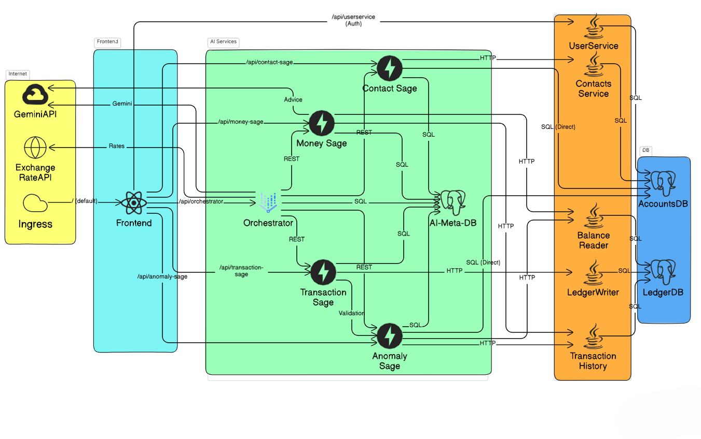

The system is organized into three distinct layers, all deployed on **Kubernetes** and horizontally scalable:

### Layer 1: Frontend (Cyan)
The new React/Vite frontend serves as the single entry point via a Kubernetes Ingress. It routes API calls to both the AI services layer and the original core services through path-based routing (e.g., `/api/orchestrator`, `/api/contact-sage`, `/api/userservice`).

### Layer 2: AI Services (Green)
Five specialized Python microservices powered by **FastAPI**, each with a single responsibility:
- **Orchestrator** — The central brain. Uses **Google Gemini** for natural language understanding, intent classification, entity extraction, and multi-turn conversation. It coordinates all other Sage services.
- **Anomaly Sage** — Real-time fraud detection using statistical analysis (Welford's algorithm for running mean/variance), velocity checks, and new-recipient detection. Returns explainable risk scores.
- **Money Sage** — Budget management and financial insights. Uses **Google Gemini** to analyze spending patterns and generate personalized saving tips.
- **Transaction Sage** — Intelligent transaction execution with automatic categorization (30+ category keywords), budget enforcement, and detailed logging.
- **Contact Sage** — Smart contact resolution using fuzzy matching (`thefuzz`), internal account validation, and full CRUD operations.
- **AI-Meta-DB** — Shared PostgreSQL database storing all AI state: anomaly logs, transaction logs, budgets, user profiles, conversation memory, and exchange rates.

### Layer 3: Core Banking Services (Orange)
The original, **unmodified** Google Bank of Anthos services:
- **UserService** (Python) — Authentication and JWT signing.
- **Contacts** (Python) — Core contact storage.
- **LedgerWriter** (Java) — Immutable transaction ledger writes.
- **BalanceReader** (Java) — Cached account balance reads.
- **TransactionHistory** (Java) — Cached transaction history reads.
- **AccountsDB / LedgerDB** (PostgreSQL) — Original data stores.

### External Services (Yellow)
- **Google Gemini API** — Powers NLU in the Orchestrator and financial advice in Money Sage.
- **Exchange Rate API** — Provides live currency conversion rates with 24-hour caching and API fallback.


## Screenshots

### Sign In & Sign Up
| Sign In | Sign Up |
|:---:|:---:|
| 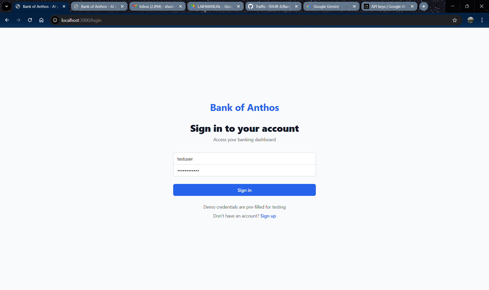 | 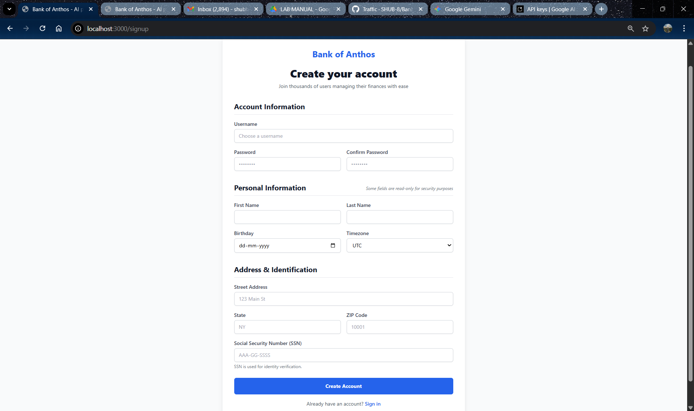 |

### Dashboard
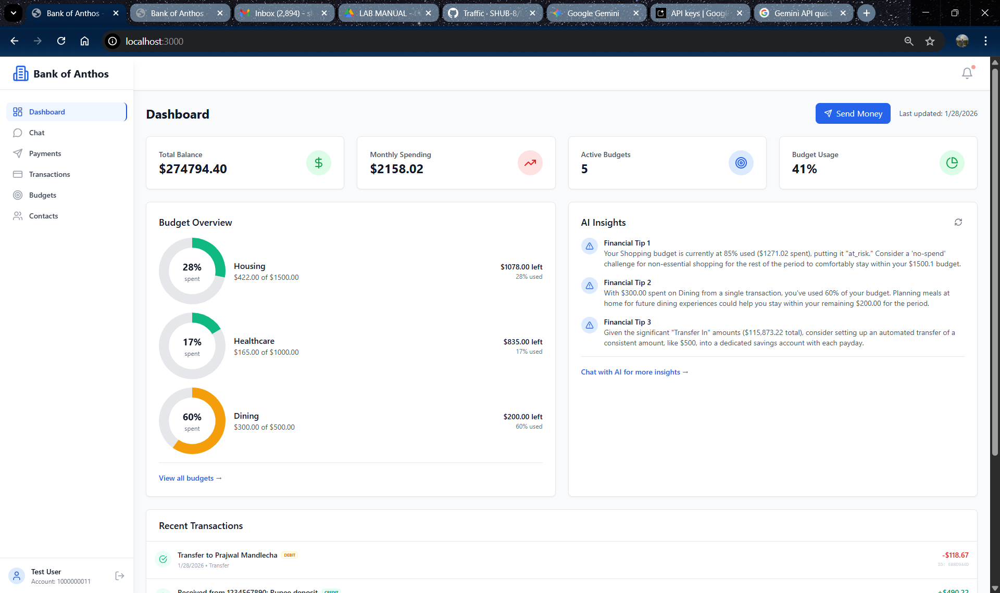

### AI Conversational Assistant
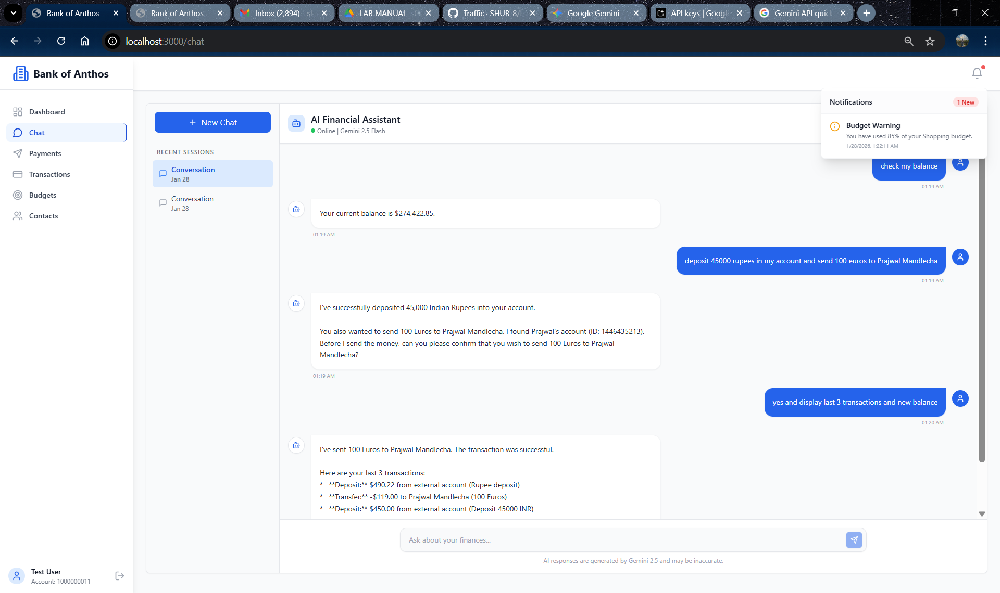 

### Payments
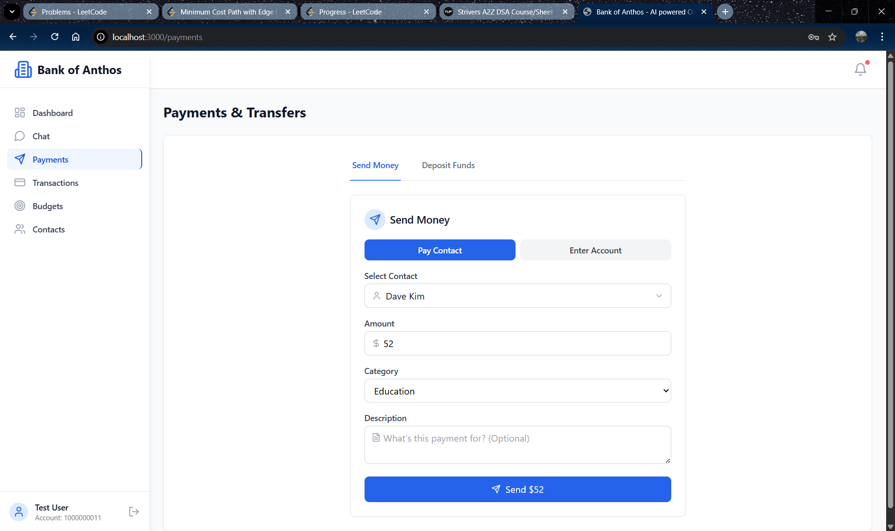

### Transaction History
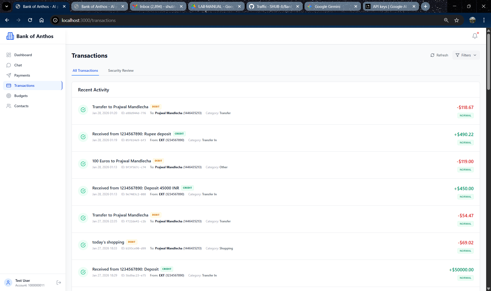

### Anomaly Detection & Security
| Anomaly Logs | Security Review |
|:---:|:---:|
| 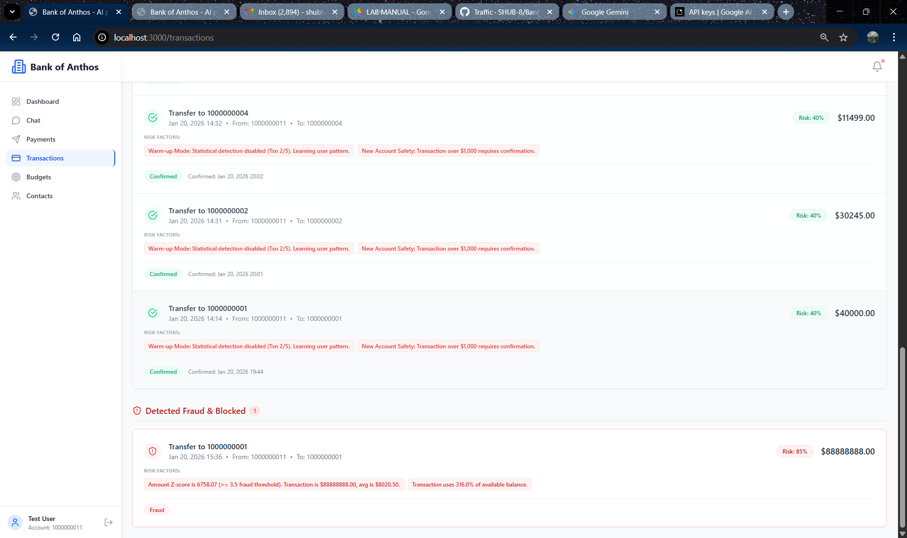 | 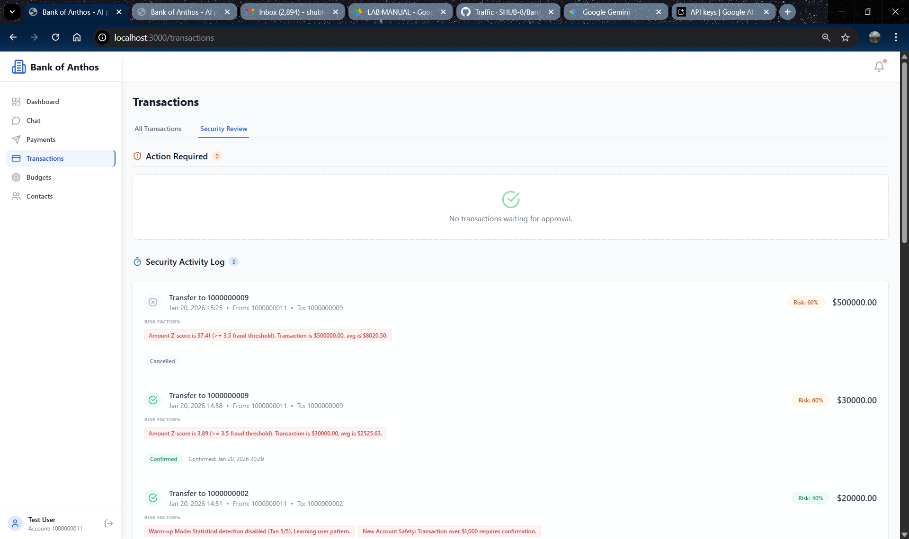 |

### Budget Management
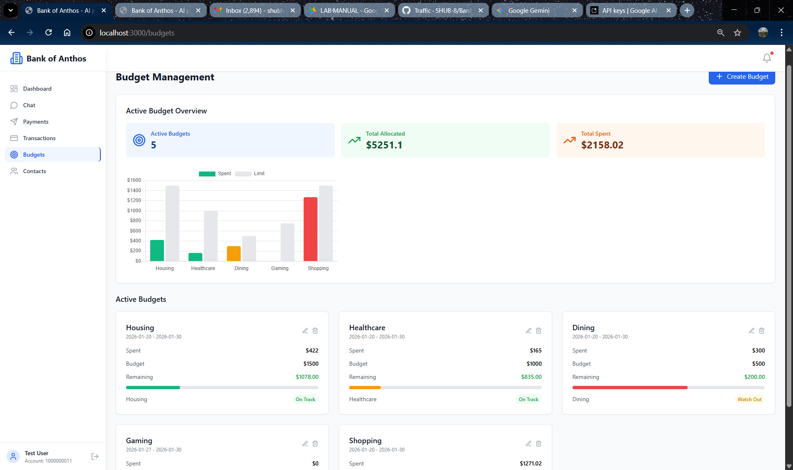

### Contact Management
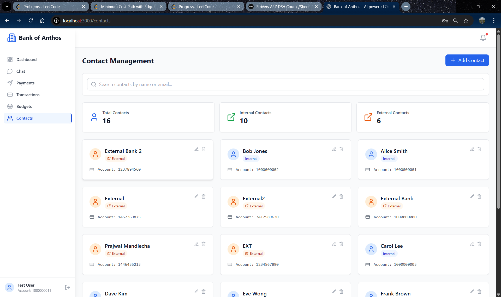


## Services

### Core Banking Services (Unchanged from Google's Original)

| Service                                                 | Language      | Description                                                                                                                                |
| ------------------------------------------------------- | ------------- | ------------------------------------------------------------------------------------------------------------------------------------------ |
| [frontend](/src/frontend)                              | Python        | Exposes an HTTP server to serve the website. Contains login page, signup page, and home page.                                              |
| [ledger-writer](/src/ledger/ledgerwriter)              | Java          | Accepts and validates incoming transactions before writing them to the ledger.                                                             |
| [balance-reader](/src/ledger/balancereader)            | Java          | Provides efficient readable cache of user balances, as read from `ledger-db`.                                                              |
| [transaction-history](/src/ledger/transactionhistory)  | Java          | Provides efficient readable cache of past transactions, as read from `ledger-db`.                                                          |
| [ledger-db](/src/ledger/ledger-db)                     | PostgreSQL    | Ledger of all transactions. Option to pre-populate with transactions for demo users.                                                       |
| [user-service](/src/accounts/userservice)              | Python        | Manages user accounts and authentication. Signs JWTs used for authentication by other services.                                            |
| [contacts](/src/accounts/contacts)                     | Python        | Stores list of other accounts associated with a user. Used for drop down in "Send Payment" and "Deposit" forms.                            |
| [accounts-db](/src/accounts/accounts-db)               | PostgreSQL    | Database for user accounts and associated data. Option to pre-populate with demo users.                                                    |
| [loadgenerator](/src/loadgenerator)                    | Python/Locust | Continuously sends requests imitating users to the frontend. Periodically creates new accounts and simulates transactions between them.    |

### AI Services Layer (New)

| Service                                                 | Language      | Description                                                                                                                                |
| ------------------------------------------------------- | ------------- | ------------------------------------------------------------------------------------------------------------------------------------------ |
| [orchestrator](/ai-services/orchestrator)              | Python        | Central AI coordinator powered by **Google Gemini**. Provides a conversational chat interface, handles NLU, intent classification, entity extraction, and orchestrates all other AI agents. |
| [anomaly-sage](/ai-services/anomaly-sage)              | Python        | Real-time fraud detection engine. Uses statistical analysis (Welford's algorithm) and multi-factor risk scoring to classify transactions as `normal`, `pending`, or `fraud` with explainable reasons. |
| [money-sage](/ai-services/money-sage)                  | Python        | Financial insights and budget management. Provides spending summaries, budget CRUD, and **Gemini-powered** personalized saving tips.       |
| [transaction-sage](/ai-services/transaction-sage)      | Python        | Intelligent transaction execution. Auto-categorizes transactions (30+ categories), enforces budget limits, and logs detailed records before calling the core `ledger-writer`. |
| [contact-sage](/ai-services/contact-sage)              | Python        | Smart contact management. Extends the core `contacts` service with fuzzy name matching, internal account validation, and direct update/delete operations. |
| [ai-meta-db](/ai-services/ai-meta-db)                  | PostgreSQL    | Shared AI metadata database. Stores anomaly logs, transaction logs, budgets, user profiles, conversation memory, exchange rates, and audit trails. |

### New Frontend (New)

| Service                                                 | Language      | Description                                                                                                                                |
| ------------------------------------------------------- | ------------- | ------------------------------------------------------------------------------------------------------------------------------------------ |
| [new-frontend](/New_Frontend)                          | TypeScript    | Modern React/Vite SPA with Tailwind CSS. Replaces the original Jinja2 templates with a responsive, component-based UI featuring the AI chat assistant, budget dashboards, and anomaly logs. |


### How the AI Layer Integrates (No Core Changes)

The AI services consume the core services' existing HTTP APIs — they don't modify them:

```
User Query: "Send $50 to Bob for lunch"
    │
    ▼
┌─────────────────┐
│   Orchestrator  │──── Gemini API (intent: send_money, amount: $50, recipient: "Bob")
└────────┬────────┘
         │
    ┌────▼─────┐
    │Contact   │──── Calls core `contacts` service via HTTP ──► Resolves "Bob" → account 9530551227
    │  Sage    │
    └────┬─────┘
         │
    ┌────▼─────┐
    │Anomaly   │──── Calls core `balance-reader` & `transaction-history` via HTTP ──► Risk score: 0.15 (normal)
    │  Sage    │
    └────┬─────┘
         │
    ┌────▼───────┐
    │Transaction │──── Calls core `ledger-writer` via HTTP ──► Transaction executed
    │   Sage     │
    └────────────┘
```

> **Every core service is called through its original, unmodified REST API.** The AI layer is purely additive.

### Running & testing AI services (local / dev)

Each AI microservice under `ai-services/` is a small Python app with a `main.py` and a `requirements.txt`. The `ai-meta-db/` directory contains a PostgreSQL schema (`0001_create_ai_meta_tables.sql`) and a `Dockerfile` to run the database locally.

Quick steps (PowerShell):

```powershell
# 1) Install Python dependencies for the services you want to run (example installs orchestrator deps)
python -m pip install --upgrade pip; python -m pip install -r .\ai-services\orchestrator\requirements.txt

# 2) Run the AI service directly (example: orchestrator)
python .\ai-services\orchestrator\main.py

# 3) Run the database locally (optional) using the Dockerfile in ai-meta-db, or use your preferred Postgres instance.
#    Example: docker build -t ai-meta-db:local .\ai-services\ai-meta-db; docker run -p 5432:5432 ai-meta-db:local

# 4) Run the AI services tests from the repo root (requires pytest)
python -m pip install pytest; pytest .\ai-services\test_ai_services.py -q
```

Notes:
- If you prefer to install all AI service deps at once, install each `requirements.txt` found in `ai-services/*/requirements.txt` or use a virtual environment per service.
- The tests under `ai-services/` are small integration/unit tests for the agent code (see `test_anomaly_sage.py`, `test_contact_sage.py`, `test_money_sage.py`, `test_transaction_sage.py`).


## Interactive quickstart (GKE)

The following button opens up an interactive tutorial showing how to deploy Bank of Anthos in GKE:

[](https://ssh.cloud.google.com/cloudshell/editor?show=ide&cloudshell_git_repo=https://github.com/GoogleCloudPlatform/bank-of-anthos&cloudshell_workspace=.&cloudshell_tutorial=extras/cloudshell/tutorial.md)

## Quickstart (GKE)

1. Ensure you have the following requirements:
   - [Google Cloud project](https://cloud.google.com/resource-manager/docs/creating-managing-projects#creating_a_project).
   - Shell environment with `gcloud`, `git`, and `kubectl`.

2. Clone the repository.

   ```sh
   git clone https://github.com/GoogleCloudPlatform/bank-of-anthos
   cd bank-of-anthos/
   ```

3. Set the Google Cloud project and region and ensure the Google Kubernetes Engine API is enabled.

   ```sh
   export PROJECT_ID=<PROJECT_ID>
   export REGION=us-central1
   gcloud services enable container.googleapis.com \
     --project=${PROJECT_ID}
   ```

   Substitute `<PROJECT_ID>` with the ID of your Google Cloud project.

4. Create a GKE cluster and get the credentials for it.

   ```sh
   gcloud container clusters create-auto bank-of-anthos \
     --project=${PROJECT_ID} --region=${REGION}
   ```

   Creating the cluster may take a few minutes.


5. Deploy Bank of Anthos and all AI agent microservices to the cluster.

   ```sh
   kubectl apply -f ./extras/jwt/jwt-secret.yaml
   kubectl apply -f ./kubernetes-manifests/
   ```


6. Wait for the pods to be ready.

   ```sh
   kubectl get pods
   ```

   After a few minutes, you should see the Pods in a `Running` state:

   ```
   NAME                                  READY   STATUS    RESTARTS   AGE
   accounts-db-6f589464bc-6r7b7          1/1     Running   0          99s
   ai-meta-db-7c8d9f6b7c-xyz12           1/1     Running   0          99s
   anomaly-sage-6d7c8f9b7c-abc34         1/1     Running   0          99s
   transaction-sage-7b8c9d0e1f-def56     1/1     Running   0          99s
   contact-sage-8c9d0e1f2g-hij78         1/1     Running   0          99s
   money-sage-9d0e1f2g3h-klm90           1/1     Running   0          99s
   orchestrator-0e1f2g3h4i-nop12         1/1     Running   0          99s
   balancereader-797bf6d7c5-8xvp6        1/1     Running   0          99s
   contacts-769c4fb556-25pg2             1/1     Running   0          98s
   frontend-7c96b54f6b-zkdbz             1/1     Running   0          98s
   ledger-db-5b78474d4f-p6xcb            1/1     Running   0          98s
   ledgerwriter-84bf44b95d-65mqf         1/1     Running   0          97s
   loadgenerator-559667b6ff-4zsvb        1/1     Running   0          97s
   transactionhistory-5569754896-z94cn   1/1     Running   0          97s
   userservice-78dc876bff-pdhtl          1/1     Running   0          96s
   ```

7. Access the web frontend in a browser using the frontend's external IP.

   ```sh
   kubectl get service frontend | awk '{print $4}'
   ```

   Visit `http://EXTERNAL_IP` in a web browser to access your instance of Bank of Anthos.

8. Once you are done with it, delete the GKE cluster.

   ```sh
   gcloud container clusters delete bank-of-anthos \
     --project=${PROJECT_ID} --region=${REGION}
   ```

   Deleting the cluster may take a few minutes.

## Additional deployment options


- **Workload Identity**: [See these instructions.](/docs/workload-identity.md)
- **Cloud SQL**: [See these instructions](/extras/cloudsql) to replace the in-cluster databases with hosted Google Cloud SQL.
- **Multi Cluster with Cloud SQL**: [See these instructions](/extras/cloudsql-multicluster) to replicate the app across two regions using GKE, Multi Cluster Ingress, and Google Cloud SQL.
- **Istio**: [See these instructions](/extras/istio) to configure an IngressGateway.
- **Anthos Service Mesh**: ASM requires Workload Identity to be enabled in your GKE cluster. [See the workload identity instructions](/docs/workload-identity.md) to configure and deploy the app. Then, apply `extras/istio/` to your cluster to configure frontend ingress.
- **Java Monolith (VM)**: We provide a version of this app where the three Java microservices are coupled together into one monolithic service, which you can deploy inside a VM (eg. Google Compute Engine). See the [ledgermonolith](/src/ledgermonolith) directory.


## Documentation

- [AI Services Overview](/ai-services/README.md) — Architecture, agent responsibilities, API contracts, and full AI-Meta DB schema.
- [Orchestrator](/ai-services/orchestrator/README.md) — Gemini-powered conversational AI engine.
- [Anomaly Sage](/ai-services/anomaly-sage/README.md) — Fraud detection and risk scoring.
- [Money Sage](/ai-services/money-sage/README.md) — Budget management and financial insights.
- [Transaction Sage](/ai-services/transaction-sage/README.md) — Intelligent transaction execution.
- [Contact Sage](/ai-services/contact-sage/README.md) — Smart contact management with fuzzy matching.
- [GKE Autopilot Deployment Guide](/docs/GKE_AUTOPILOT_DEPLOYMENT.md) — Cluster setup on GKE Autopilot.
- [Local Development](/docs/LOCAL_DEVELOPMENT.md) — Running the full stack locally.
- [Development](/docs/development.md) — General development guide.
- [Environments](/docs/environments.md) — Deploying on non-GKE clusters.
- [Workload Identity](/docs/workload-identity.md) — GKE Workload Identity setup.
- [CI/CD pipeline](/docs/ci-cd-pipeline.md) — CI/CD pipeline details.
- [Troubleshooting](/docs/troubleshooting.md) — Common issues and fixes.

## Requirements
- Python 3.12+
- pip 25.1.1+

**Note:** Please ensure you have pip >= 25.1.1 installed before building or testing.
Upgrade with: `python -m pip install --upgrade pip`

## Demos featuring Bank of Anthos
- [Tutorial: Explore Anthos (Google Cloud docs)](https://cloud.google.com/anthos/docs/tutorials/explore-anthos)
- [Tutorial: Migrating a monolith VM to GKE](https://cloud.google.com/migrate/containers/docs/migrating-monolith-vm-overview-setup)
- [Tutorial: Running distributed services on GKE private clusters using ASM](https://cloud.google.com/service-mesh/docs/distributed-services-private-clusters)
- [Tutorial: Run full-stack workloads at scale on GKE](https://cloud.google.com/kubernetes-engine/docs/tutorials/full-stack-scale)
- [Architecture: Anthos on bare metal](https://cloud.google.com/architecture/ara-anthos-on-bare-metal)
- [Architecture: Creating and deploying secured applications](https://cloud.google.com/architecture/security-foundations/creating-deploying-secured-apps)
- [Keynote @ Google Cloud Next '20: Building trust for speedy innovation](https://www.youtube.com/watch?v=7QR1z35h_yc)
- [Workshop @ IstioCon '22: Manage and secure distributed services with ASM](https://www.youtube.com/watch?v=--mPdAxovfE)

## Platform-specific Maven wrapper usage
- **Windows:** Use `mvnw.cmd` and backslashes in paths (e.g., `..\..\..\mvnw.cmd checkstyle:check`)
- **Linux/Mac:** Use `mvnw` and forward slashes (e.g., `../../../mvnw checkstyle:check`)
If you see `'..' is not recognized as an internal or external command`, update your test command as above.
