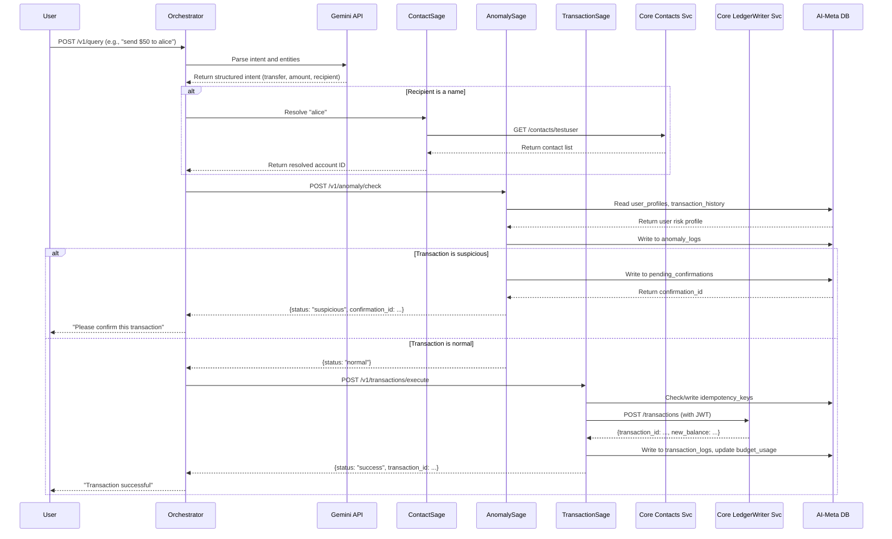

# Bank of Anthos - AI Services Layer

This document provides a complete overview of the AI-powered microservices layer for Bank of Anthos. It details the architecture, the individual responsibilities of each AI agent, their API contracts, and their interactions with the core banking services.

## Architecture Diagram

The following diagram illustrates the flow of a user query through the AI services layer and its interaction with the core Bank of Anthos services.

## AI Agents & Services

### 1. Orchestrator

The single entry point for all user queries. It is responsible for NLU, entity resolution, and coordinating the other AI agents.

- **Endpoint:** `POST /v1/query`
- **Request Body:** `{"query": "..."}`
- **Authentication:** Requires a valid JWT in the `Authorization: Bearer <token>` header.
- **Interactions:**
    - Calls **Gemini API** to parse intent.
    - Calls **Contact-Sage** to resolve recipient names.
    - Calls **Anomaly-Sage** to perform risk analysis on transactions.
    - Calls **Transaction-Sage** for non-financial intents (future implementation).
    - Calls **Balance-Reader** core service directly for balance inquiries.

### 2. Anomaly-Sage

Performs risk analysis on proposed transactions to identify and flag suspicious or fraudulent activity.

- **Endpoint:** `POST /v1/anomaly/check`
- **Request Body:** `AnomalyCheckRequest` (account_id, amount_cents, recipient_account_id, etc.)
- **Response Body:** `AnomalyCheckResponse` (status, risk_score, action, confirmation_id)
- **Interactions:**
    - Reads from `user_profiles` and `transaction_logs` in the **AI-Meta DB**.
    - Writes to `anomaly_logs` and `pending_confirmations` in the **AI-Meta DB**.
    - Does **not** call any other services directly. Its output determines the Orchestrator's next step.

### 3. Transaction-Sage

Executes the financial transaction after it has been cleared by the `Anomaly-Sage`. It is the only AI service that communicates with the core ledger.

- **Endpoint:** `POST /v1/transactions/execute`
- **Request Body:** `TransactionExecuteRequest` (account_id, amount_cents, recipient_account_id, etc.)
- **Response Body:** `TransactionExecuteResponse` (status, transaction_id, new_balance, etc.)
- **Interactions:**
    - Reads from and writes to `idempotency_keys` in the **AI-Meta DB**.
    - Calls the **Core LedgerWriter Service** (`POST /transactions`) to execute the transaction.
    - Writes to `transaction_logs` and updates `budget_usage` in the **AI-Meta DB** after a successful transaction.

### 4. Contact-Sage (To Be Implemented)

Resolves contact names into account numbers.

- **Endpoint:** `POST /v1/contacts/resolve`
- **Interactions:**
    - Calls the **Core Contacts Service** (`GET /contacts/<username>`) to fetch the user's address book.
    - Performs fuzzy matching to find the correct contact.

---

## AI-Meta DB Schema

This PostgreSQL database supports the AI agents. See the schema definition in `ai-meta-db/0001_create_ai_meta_tables.sql`.

### `anomaly_logs`
Logs risk analysis results from `anomaly-sage`.

### `transaction_logs`
Logs transaction details and categorization from `transaction-sage`.

### `budgets` & `budget_usage`
Tracks budget allocations and usage per user and category.

### `user_profiles`
Stores user-specific data for risk analysis.

### `pending_confirmations`
Stores pending transaction confirmations for `anomaly-sage`.

### `idempotency_keys`
Ensures that transactions are not processed more than once by `transaction-sage`.
| Column | Type | Description |
|---|---|---|
| key | VARCHAR(255) | The unique idempotency key from the request header. |
| account_id | CHARACTER(10) | User account identifier. |
| status | VARCHAR | `in_progress`, `completed`, or `failed`. |
| created_at | TIMESTAMP | Log creation time. |
| response_payload | JSONB | The JSON response of the completed request. |

